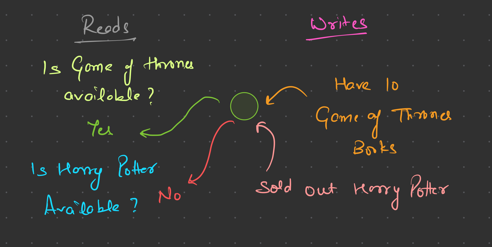
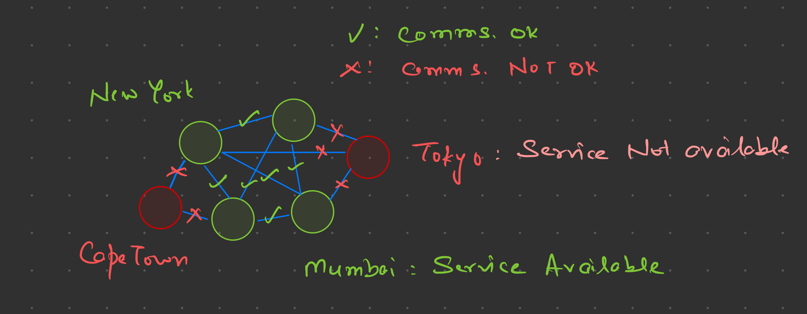
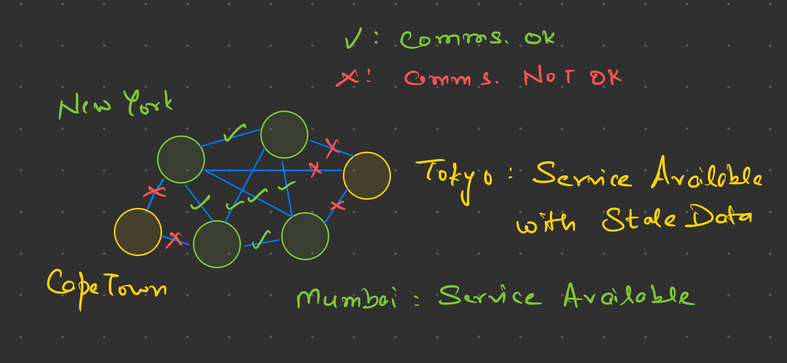
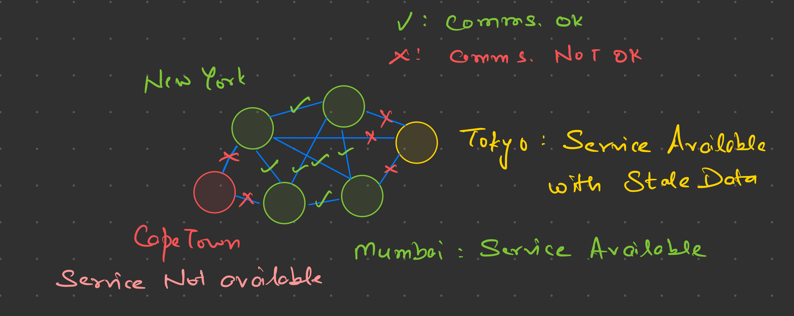

+++
title = 'Understanding the CAP Theorem: Consistency, Availability, and Partition Tolerance in Distributed Systems'
date = 2024-07-27T13:52:09+05:30
description = 'Discover the CAP Theorem, which states that a distributed system can only achieve two out of three properties: Consistency, Availability, and Partition Tolerance. Learn how to balance these trade-offs with real-world examples.'
draft = false
keywords = 'CAP theorem, Brewer’s theorem, Consistency, Availability, Partition Tolerance, distributed systems, network partition, trade-offs, CA, CP, AP, database, distributed database, network issues'
[params]
	author = 'Naman Attri'
slug = 'understanding-cap-theorem-consistency-availability-partition-tolerance'
+++
## What is CAP Theorem?

The CAP theorem, also known as Brewer’s theorem, states that in any distributed data store, it is impossible to simultaneously guarantee Consistency, Availability, and Partition tolerance.

## Consistency, Availability, and Partition Tolerance Explained

### Consistency

Every read receives the most recent write or an error. All nodes in a distributed system see the same data at the same time. After a write operation, all subsequent reads will return the same data.

### Availability

Every request receives a response, regardless of the state of any individual node or network partition. Without guarantee that it contains the most recent write.

### Partition tolerance

The system continues to operate despite an arbitrary number of messages being dropped (or delayed) by the network between nodes. A partition occurs when communication between some nodes is lost or delayed, isolating parts of the network. Partitions can be caused by network failures, congestion, software bugs, or maintenance activities.

The CAP theorem states that a distributed system can only provide two out of the three properties at the same time. If there is a network partition, the system must choose between consistency and availability.

## Trade-offs in Distributed Systems

A distributed system cannot achieve all three properties simultaneously because during a network partition to maintain consistency, the system would need to reject some requests to ensure all nodes see the same data, sacrificing availability. To maintain availability, the system would need to allow requests to proceed even if nodes have divergent states, sacrificing consistency.

And hence the Trade-offs:

### CA (Consistency + Availability) 

Systems that work well when there are no network partitions.

### CP (Consistency + Partition tolerance) 

Systems that ensure consistency and can handle partitions but might not be available during partitions.

### AP (Availability + Partition tolerance) 

Systems that remain available even during partitions but may not be consistent.

## Understanding CAP Theorem with a simple example:

Imagine a distributed database system with nodes A, B, and C. If a network issue causes nodes A and B to lose communication with node C, a network partition occurs. During this partition:

* If the system prioritizes availability, nodes A and B might continue to operate and accept writes, which could lead to inconsistencies with node C.
* If the system prioritizes consistency, it might block writes to ensure all nodes remain synchronized, reducing availability.
* If the system is partition-tolerant, it will continue to function despite the partition by making a trade-off between consistency and availability, meaning it might accept writes on nodes A and B but ensure eventual consistency with node C once communication is restored, or it may choose to serve reads with potentially stale data to maintain availability during the partition.

## Understanding CAP Theorem with a Real-World Example

Imagine we own a popular online bookstore called "Book Haven." As your business grows, we decide to scale your system to handle millions of users across the globe. To do this effectively, we need to consider the CAP theorem, which helps us understand the trade-offs in designing distributed systems.

### Day 1: Launch Day

You launch Book Haven with a single database server. 

The system is:

- **Consistent (C)**: All users see the same data because there's only one database.
- **Available (A)**: The server responds to every request.
- **Partition Tolerant (P)**: Partition tolerance isn't an issue yet because we have a single server.

### Day 100: The Business Grows

As our bookstore becomes popular, we decide to add more servers to handle the load. We distribute the database across multiple servers around the world.

#### Scenario 1: Focusing on Consistency and Partition Tolerance (CP)

We decide that it's crucial for all users to see the most up-to-date inventory and prices. To ensure consistency, we implement a strong consistency model. However, network issues (partitions) can happen, causing some servers to be unreachable.

- **Consistency (C)**: Ensured. Users always see the latest data.
- **Availability (A)**: Sacrificed. During network partitions, some requests may not be served because the system prioritizes consistency. Users might experience downtime or delays.
- **Partition Tolerance (P)**: Ensured. The system can handle network failures by rerouting requests.

Example: A user in New York sees the exact same book availability as a user in Tokyo. However, during a network partition, users in Tokyo might not be able to access the site until the partition is resolved.

#### Scenario 2: Focusing on Availability and Partition Tolerance (AP)

We decide that the website must always be up and running. Even if there are network partitions, we want users to be able to browse and purchase books.

- **Consistency (C)**: Sacrificed. Different servers might have slightly different data due to network partitions. Users might see stale data.
- **Availability (A)**: Ensured. The system always responds to requests.
- **Partition Tolerance (P)**: Ensured. The system can handle network failures by rerouting requests.

Example: A user in New York might see that a book is available, while a user in Tokyo might see it as out of stock if the servers haven't synchronized yet. However, both users can continue to browse and make purchases.

#### Scenario 3: Focusing on Consistency and Availability (CA)

We decide that every request must receive the most recent data and the system must always be up. However, we don't account for network partitions effectively.

- **Consistency (C)**: Ensured. Users always see the latest data.
- **Availability (A)**: Ensured. The system always responds to requests.
- **Partition Tolerance (P)**: Sacrificed. During network partitions, the system may fail or become inconsistent because it can't handle the partition properly.

Example: If a network partition occurs, our system might crash or provide incorrect data because it can't maintain both consistency and availability in the face of the partition.

## Choosing the Right Balance

In the real world, we often need to strike a balance based on our application's requirements. For Naman's Book Haven, we might prioritize **AP**:

- **Availability (A)**: Ensuring the bookstore is always online.
- **Partition Tolerance (P)**: Handling network issues gracefully.
- Accepting that **Consistency (C)** might sometimes be weak, meaning users might occasionally see stale data.

This approach ensures that our global user base can always access the bookstore, even if they sometimes see slightly outdated information.

## Conclusion

The CAP theorem highlights the trade-offs in distributed system design. By understanding and applying these principles, we can make informed decisions that align with our business priorities, ensuring the best possible experience for our users.